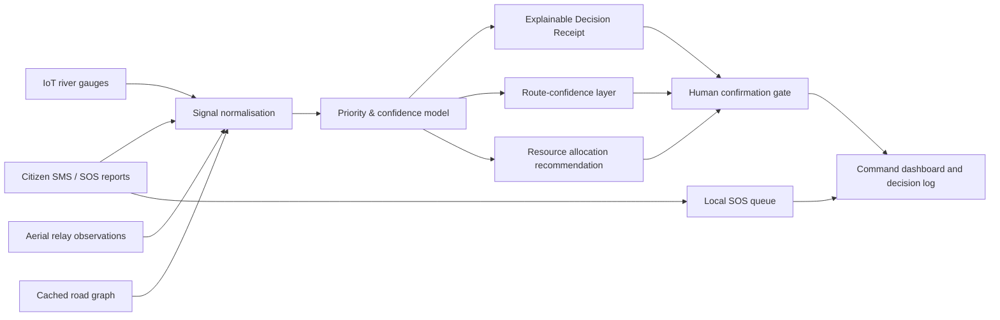

# CrisisGrid

> **Resilient crisis-response coordination when the map, the network, and the minutes are all failing.**

**CrisisGrid** is a front-end prototype for **STAMPERS National Hackathon 2026, Track 06: Autonomous Crisis Response & Resource Coordination**. It demonstrates how emergency coordinators can combine heterogeneous signals, prioritise affected areas, explain resource-allocation recommendations, keep citizen reports available during partial network failure, and retain meaningful operational context when live infrastructure degrades.

The current project intentionally uses a clearly labelled **simulated monsoon-flood scenario**. It is a hackathon prototype, not an operational emergency-management system, and it must not be used to make real-world dispatch or medical decisions.

| Submission item | Link |
|---|---|
| Live prototype | [stampers-crisisgrid.vercel.app](https://stampers-crisisgrid.vercel.app) |
| Demo walkthrough | [Watch the video demo](https://files.manuscdn.com/user_upload_by_module/session_file/91236325/DoMzKNkGELeZUkUq.mp4) |
| Submission index | [`docs/SUBMISSION_LINKS.md`](docs/SUBMISSION_LINKS.md) |

## The Problem

Large-scale emergencies create an information problem before they become a logistics problem. Reports arrive from citizens, sensors, responders, and infrastructure systems at different levels of reliability. Connectivity can fail precisely when it is needed most. A command interface that merely displays a map does not solve the hard question: **which location deserves limited resources first, and why?**

CrisisGrid turns that question into a reviewable decision workflow. It presents simulated evidence, a visible priority receipt, a human-approval gate, route confidence, resource capacity, and a fallback communications mode in one coordinated view.

## What Makes It Novel

The project’s differentiator is the **Decision Receipt**. Rather than returning an opaque “high priority” label, CrisisGrid breaks every recommendation into weighted, human-readable contributing factors:

| Decision component | Demonstrated purpose |
|---|---|
| Life-safety exposure | Makes potential human impact the leading factor. |
| Water-rise velocity | Elevates urgency when conditions are deteriorating quickly. |
| Route accessibility | Avoids recommending resources that cannot credibly reach the location. |
| Report reliability | Shows how confidence changes when evidence is incomplete or degraded. |
| Human confirmation | Prevents automatic dispatch across a safety threshold. |

This model supports an important operational principle: **automation should make a recommendation inspectable, not make human responsibility invisible.**

## Core Capabilities

| Hackathon requirement | CrisisGrid implementation |
|---|---|
| Real-time crisis mapping | Interactive territory plane with four selectable risk zones, risk scores, simulated incident positions, and viable-route overlays. |
| Dynamic risk-zone detection | Selecting a zone updates its priority score, potential isolation count, confidence, and decision log. |
| Resource allocation | A human-approved dispatch reduces available rescue-boat capacity and logs the destination and route. |
| Emergency route optimisation | The map displays primary and alternate routes with a route-confidence signal that changes in degraded-network mode. |
| Citizen SOS/reporting system | The low-connectivity reporting form queues SOS receipts locally in the browser. |
| Offline/low-connectivity capability | A **Mesh Fallback** mode simulates 40% infrastructure loss, favours cached road-graph and SMS relay data, and retains SOS receipts in local storage. |
| Real-time command dashboard | The situation board consolidates map, decision receipt, field feed integrity, resource capacity, communications status, and an event log. |

## Product Walkthrough

The command board begins on a simulated flood incident in West Bengal. The highest-priority zone is shown in the Decision Receipt. A coordinator can select another zone on the map, inspect why it is ranked, switch to **Mesh Fallback**, submit a low-bandwidth SOS report, and approve a resource dispatch. Each step modifies the visible state so the demo communicates a complete crisis-response loop rather than static screens.

### Safety and Transparency

The user interface explicitly calls out that human confirmation is required before crossing a water-depth threshold. The product copy also clearly labels simulated inputs. These design decisions are intentional: high-stakes software should signal its uncertainty and boundaries, not imply that automated recommendations are definitive.

## Architecture



The deployed prototype is deliberately client-side so that its demo is portable and can be inspected directly. It uses React, TypeScript, Tailwind CSS, and browser local storage for the local SOS queue. The data inputs, scoring values, and route paths are representative simulated data only.

## Technology Stack

| Layer | Tooling |
|---|---|
| Application | React 19 + TypeScript |
| Build system | Vite |
| Styling | Tailwind CSS 4 + custom CSS design system |
| Iconography | Lucide React |
| Resilience prototype | Browser local storage for queued SOS receipts |
| Deployment target | Vercel |

## Running Locally

Install dependencies and start the development server from the repository root.

```bash
pnpm install
pnpm dev
```

Create a production build with:

```bash
pnpm build
```

## Demo Scenario

The project uses a single coherent scenario so judges can validate the whole workflow in a short demonstration.

| Stage | Demonstration event | Expected visible outcome |
|---|---|---|
| 1 | A coordinator inspects Farakka East. | The Decision Receipt shows risk score 94 and a 78% confidence value. |
| 2 | The coordinator switches to **Mesh Fallback**. | Network state changes, local-cache language appears, and route confidence changes to 68%. |
| 3 | The coordinator selects Raghunathganj. | The priority receipt, zone details, and event log update to the new zone. |
| 4 | The coordinator approves a dispatch. | Boat unit R-12 is logged as dispatched and ready rescue-boat capacity reduces from 3 to 2. |
| 5 | A citizen report is queued through **Log SOS**. | The low-connectivity form confirms the receipt and the locally stored count increases. |

## Evaluation-Criteria Alignment

| Criterion | How CrisisGrid addresses it |
|---|---|
| Innovation and originality | The Decision Receipt combines transparent prioritisation, confidence, and a human-approval gate rather than a black-box risk score. |
| Problem solving and relevance | The workflow addresses prioritisation, allocation, route viability, and communication degradation in one crisis scenario. |
| Technical implementation | The prototype maintains stateful map selection, resource dispatch, network-mode transitions, and browser-side local queue persistence. |
| User experience and design | The Signal in the Storm interface uses a field-map hierarchy, clear emergency colour semantics, responsive mobile layouts, and accessible focus states. |
| Impact and scalability | The structure can be connected to live message, sensor, weather, GIS, and fleet-management feeds through a future API layer. |
| Presentation and demo | The repository includes a focused walkthrough and project-documentation template in `docs/`. |

## Repository Contents

| Path | Purpose |
|---|---|
| `client/src/pages/Home.tsx` | Main interactive command-board experience. |
| `client/src/index.css` | Signal in the Storm visual system and responsive layout. |
| `docs/PROJECT_DOCUMENTATION.md` | Submission-ready project narrative. |
| `docs/DEMO_SCRIPT.md` | Recording script for the required demo video. |
| `docs/VALIDATION.md` | Build, responsive, and interaction validation evidence. |
| `ideas.md` | Chosen design direction and brand/design decisions. |

## Future Extension Path

The next production stages would move the priority model into an auditable backend service, use encrypted storage for reports, introduce authenticated roles, verify source provenance, add a live geospatial provider, and create a two-way dispatch integration with emergency services. A production deployment would also require jurisdiction-specific governance, threat modelling, privacy review, rate limiting, audit trails, and formal human-oversight policies.

## Contact

Prepared for **STAMPERS National Hackathon 2026**. For event support, refer to the official STAMPERS communication channels and the supplied event materials.
