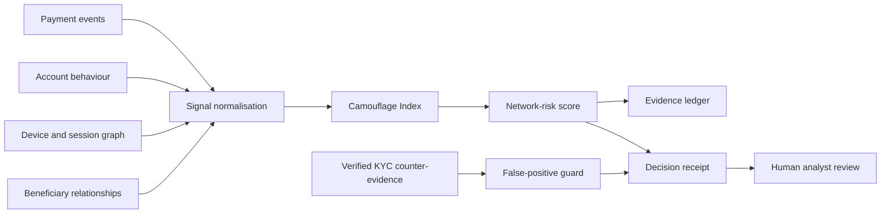

# VeilTrace

> **The transaction looked normal. The network did not.**

**VeilTrace** is a submission-ready prototype for **STAMPERS National Hackathon 2026, Track 05: Real-Time Financial Fraud & Risk Intelligence**. It detects coordinated fraud that hides behind legitimate-looking transactions by examining the relationship pattern around payments—not only the payment itself.

The project uses an intentionally simulated fraud network, as requested by the challenge hard mode. Every payment, account identifier, relationship, device, score, and outcome is fictional. VeilTrace is a decision-support demonstration, not an operational fraud engine and not a system for determining guilt.

| Submission item | Link |
|---|---|
| Live prototype | [stampers-crisisgrid.vercel.app](https://stampers-crisisgrid.vercel.app) |
| Video walkthrough | [Watch the VeilTrace demo](https://files.manuscdn.com/user_upload_by_module/session_file/91236325/FgORdAnXQloqgPYI.mp4) |
| Submission index | [`docs/SUBMISSION_LINKS.md`](docs/SUBMISSION_LINKS.md) |

## Why VeilTrace Is Different

Traditional fraud screening often asks whether one transaction appears abnormal. Sophisticated fraud networks exploit this limitation: they deliberately use ordinary amounts, realistic merchant categories, and customer-like timing. VeilTrace addresses the harder question: **does a group of ordinary-looking transactions become suspicious when viewed as a coordinated network?**

Its core innovation is the **Camouflage Index**. This measure separates individual normality from collective abnormality, allowing an investigator to see where seemingly harmless activity masks shared devices, beneficiary convergence, and repeated timing patterns.

| Evidence layer | What VeilTrace makes visible |
|---|---|
| Individual normality | Payment amounts remain inside expected personal ranges. |
| Device relay | Multiple accounts authenticate from the same device fingerprint. |
| Beneficiary convergence | Fragmented payments reassemble along an otherwise unrelated path. |
| Timing heartbeat | Payments recur at an implausibly regular cadence. |
| Counter-evidence | Verified relationships can lower risk and protect legitimate customers. |

## The Prototype Experience

The interface follows an **evidence under glass** principle. The left column is an evidence ledger; the centre is a relationship graph; the right column is a decision receipt. A reviewer can unmask a hidden ring, inspect why risk rises, apply verified KYC counter-evidence, and observe the recommendation adjust from “Hold & review” to “Allow with watch.”

This is not a static dashboard. The scenario shows a complete investigation loop:

1. The baseline view exposes only individually ordinary transactions and a low-visibility risk score.
2. **Unmask pattern** reveals the coordinated relationship ring, raises the Camouflage Index to 91/100, and produces a reviewable hold recommendation.
3. **Add verified KYC evidence** introduces a legitimate shared-device explanation, lowers the score, strengthens the false-positive guard, and leaves only the unresolved risk factors under enhanced monitoring.

## Track-Requirement Coverage

| STAMPERS requirement | VeilTrace implementation |
|---|---|
| Real-time transaction analysis | The simulated event stream shows timestamped payment activity as it enters the case. |
| Fraud probability / risk scoring | A dynamic 0–100 decision receipt changes with network evidence and counter-evidence. |
| Behavioural anomaly detection | Timing heartbeat and deviation from expected personal rhythm are visible evidence signals. |
| Graph / network fraud detection | The central graph exposes account, merchant, device, and beneficiary relationships. |
| Account / device relationship analysis | The Device Relay evidence item detects shared authentication infrastructure. |
| Explainable fraud alerts | The receipt discloses all principal score contributors, recommendation, and narrative rationale. |
| False-positive reduction | The counterfactual KYC control demonstrates a legitimate relationship lowering risk without hiding remaining signals. |

## Hard-Mode Response: The Coordinated Fraud Ring

The hard mode asks for a simulated network in which individual transactions can appear legitimate but collective behaviour reveals fraud. VeilTrace is designed specifically around this scenario. Accounts A–117, A–204, and A–381 make ordinary payments to M–9C; their shared device path, recurring timing cadence, and beneficiary hop to B–711 reveal coordination. The prototype intentionally keeps amounts modest to demonstrate that the relationship topology—not the transaction value—is the decisive signal.

## Architecture



The deployed demo is intentionally front-end only, so its state changes and logic can be inspected without credentials. A production version would move the signal and scoring model to an audited server-side service, introduce encrypted event storage, enforce role-based review workflows, and connect to bank-grade transaction, identity, and device feeds.

## Technology Stack

| Layer | Tooling |
|---|---|
| Application | React 19 + TypeScript |
| Build tooling | Vite |
| Interface | Tailwind CSS 4 + custom Evidence Under Glass design system |
| Network visualisation | Purpose-built SVG relationship graph |
| Icons | Lucide React |
| Hosting | Vercel |

## Run Locally

```bash
pnpm install
pnpm dev
```

Create a production build with:

```bash
pnpm build
```

## Responsible Use

VeilTrace demonstrates how fraud intelligence can make a recommendation understandable and contestable. It should not automatically freeze funds, deny service, or label a person as fraudulent. Any real deployment would require formal model-governance controls, independent bias testing, privacy and security review, audit trails, lawful data-use agreements, and trained human analysts.

## Documentation

| File | Purpose |
|---|---|
| [`docs/PROJECT_DOCUMENTATION.md`](docs/PROJECT_DOCUMENTATION.md) | Detailed problem, solution, architecture, and impact explanation. |
| [`docs/DEMO_SCRIPT.md`](docs/DEMO_SCRIPT.md) | Narrated 2-minute walkthrough for a replacement or extended recording. |
| [`docs/VALIDATION.md`](docs/VALIDATION.md) | Build, visual, interaction, and criteria-alignment record. |
| [`docs/SUBMISSION_LINKS.md`](docs/SUBMISSION_LINKS.md) | Ready-to-paste final-submission URLs. |
