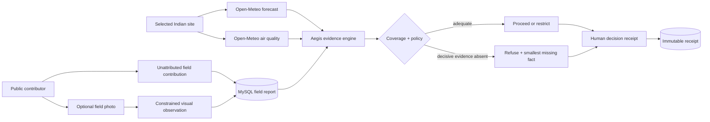

# Aegis — Project Documentation

## Problem and Product Thesis

Outdoor teams often need a short, defensible answer to a simple operational question: **can the team proceed safely now?** A conventional dashboard often obscures the more important question—whether it has enough trustworthy evidence to answer at all. Aegis makes this boundary explicit. The product accepts that the appropriate outcome can be a recommendation, a restriction, or a refusal.

> **Aegis’s core claim:** a confidence-aware system should decline a decision when the evidence required for that decision is missing, contradictory, or intentionally withheld.

The hackathon demonstration uses Indian locations and real environmental inputs. It is intentionally scoped as a live decision desk rather than an unverified continuous sensor network: each assessment is a time-bounded request for current evidence at a chosen site.

## Architecture

| Layer | Components | Responsibility |
| --- | --- | --- |
| **Experience** | React 19, TypeScript, Vite, responsive Aegis desk | Renders source provenance, telemetry, fault mode, decision rationale, and human controls. |
| **Application API** | Express and tRPC | Serves live evidence, anonymous public field contributions, and separate public human-response receipts. |
| **Evidence engine** | `server/aegis.ts` | Fetches live environmental evidence and applies a deterministic refusal policy. |
| **Visual evidence adapter** | `server/aegisPhoto.ts`, `gemini-3-flash-preview` | Validates an optional public photo and extracts only a constrained visual observation. |
| **Persistence** | Drizzle ORM and MySQL | Stores explicitly unattributed public field reports and public human-response receipts. |
| **Object storage** | Managed S3 helper | Stores only an optional field-photo object referenced from its public report. |

## Live Evidence Contract

Open-Meteo’s forecast endpoint accepts WGS84 latitude and longitude parameters and returns current and hourly weather responses; its documented variables include wind speed, wind gusts, apparent temperature, and precipitation probability. [1] The air-quality endpoint also accepts coordinates and documents current pollutant values and consolidated US AQI. [2]

Aegis asks for the smallest variable set needed for its explicit policy. It displays the returned timezone and values in the desk and treats a failed upstream fetch as unavailable evidence. It does **not** construct replacement values on the client or server.

| Source | Source status | Aegis interpretation | Failure response |
| --- | --- | --- | --- |
| Weather | `live` | Wind and weather exposure | Missing weather reduces confidence and may cause refusal. |
| Rain | `live` | Near-term surface and electrical exposure | Missing rain reduces coverage. |
| Air | `live` | Outdoor air exposure | Missing air reduces coverage and may be the smallest missing fact. |
| Field | `operator`, `unattributed`, or `missing` | Attributed field context can participate in policy; public context is visible but cannot restore confidence or change the recommendation | An absent field report is explicit; it is never manufactured. |

## Refusal and Hard-Mode Policy

The engine maintains exactly four source identities. Coverage is the share of those sources available as live or attributed operator evidence. Public contributions remain visible as `unattributed` context but do not increase coverage, confidence, risk score, or decision authority. Confidence begins with coverage, then accounts for material wind disagreement and deliberate weather evidence loss.

| Condition | Policy effect | Why it matters in the demo |
| --- | --- | --- |
| Weather source hidden | Removes decisive wind/weather context | Demonstrates that Aegis refuses to paper over a critical gap. |
| 50% coverage / 40% confidence after weather fault | `refuse` | Exposes the abstention policy in one action. |
| Field gust differs from live gust by at least 18 km/h | High-severity anomaly | Preserves uncertainty rather than averaging conflicting evidence away. |
| Live gusts at least 45 km/h | High-severity anomaly | Restricts exposed operations even when evidence is complete. |
| US AQI at least 101 or rain probability at least 70% | Adds explainable exposure | Connects each restriction input to a legible reason. |

When refusing, Aegis names the **smallest missing fact**. For a missing weather stream, that is a fresh on-site wind-gust reading. The action is not “ask for more data”; it is a bounded request a human team can understand and fulfil.

## Optional Photo Evidence: Boundaries and Privacy

Photo input is available with a public contribution. The server accepts only JPEG, PNG, and WebP data URLs at or below 2.5 MB. It persists the original as an object associated with the explicitly unattributed report. It sends the image to the server-side visual extractor, which must return a strict JSON shape containing neutral visible scene conditions, surface status, visibility, weather indicators, and whether human verification remains necessary.

The visual extractor is deliberately prohibited from identifying people, deciding whether operations may proceed, assigning a safety score, or executing an action. The field condition selected by the operator remains human-provided. Photo-derived text is supporting context only and is never silently reclassified as a live sensor source.

Operators should submit only a scene image necessary for the assessment. They should avoid faces, vehicle registration numbers, private homes, and any personal or sensitive information. The field-photo feature is optional; Aegis still refuses where the required evidence remains absent.

## Human Accountability

Aegis provides recommendations but never performs the follow-on action. The public `recordReview` procedure stores an explicitly unattributed acknowledgement, request for a check, or deferral with the decision, confidence, risk score, and evidence snapshot at that moment. This preserves the distinction between what the system recommended and what a public contributor selected, without misrepresenting the response as accountable operational authorisation.

| Record | Author | Immutable content | Purpose |
| --- | --- | --- | --- |
| Field contribution | Public contributor | Condition, measured gust when supplied, text, optional photo metadata, optional visual observation, `unattributed` marker | Surfaces context without altering the recommendation. |
| Decision receipt | Public contributor | Recommendation snapshot, confidence, risk, action, public response, note, `unattributed` marker | Records a non-authorising public response separately from the engine outcome. |

## Test and Validation Plan

The repository’s automated suite currently has **18 passing tests**. It covers deterministic proceed/restrict/refuse behaviour, visual-observation and public-contribution decision boundaries, existing route coverage, and field-photo parser guardrails. Self-cleaning integration probes exercise live evidence retrieval, hard-mode refusal, public field-report persistence, public decision-receipt persistence, and cleanup.

| Check | Result | Evidence |
| --- | --- | --- |
| Unit policy branches | Pass | `server/aegis.test.ts` covers proceed, restrict, and refuse. |
| Field-photo input guards | Pass | `server/aegisPhoto.test.ts` accepts bounded supported formats and rejects unapproved or oversized input. |
| Live public desk | Pass | Browser validation resolved live Bengaluru values and a 75% public evidence coverage. |
| 30% hard-mode loss | Pass | Hiding weather yielded 50% coverage, 40% confidence, and explicit refusal. |
| Storage and review lifecycle | Pass | Self-cleaning integration probe saved and removed temporary data. |
| Anonymous public lifecycle | Pass | Self-cleaning public API probe saved an unattributed report and receipt through public tRPC procedures, confirmed both attribution markers, and deleted both rows. |
| Production bundle | Pass | `pnpm build` completed successfully. |

## References

[1] [Open-Meteo Weather Forecast API](https://open-meteo.com/en/docs)

[2] [Open-Meteo Air Quality API](https://open-meteo.com/en/docs/air-quality-api)
